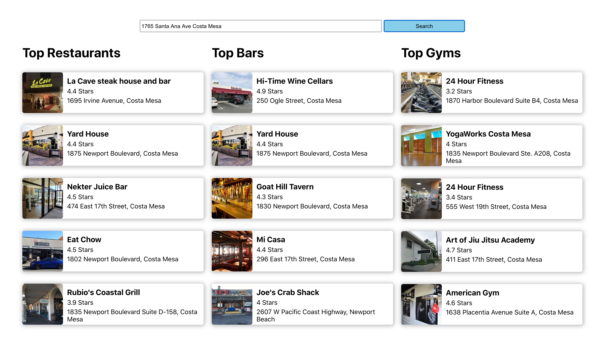

This project was bootstrapped with [Create React App](https://github.com/facebook/create-react-app).

# React Localization App

This localization app uses React Hooks within functional components. React Context is used to share the nearby places among components.
The data is asynchronously fetched from the Google Maps API. Firstly, the entered location in the search bar is translated into coordinates. Then, for these coordinates, the closest bars, restaurants, and gyms are rendered to the page.

## Technologies

I used:

- React Context API

- React Hooks

- Google maps API

- Fetch requests

- CSS Grid
